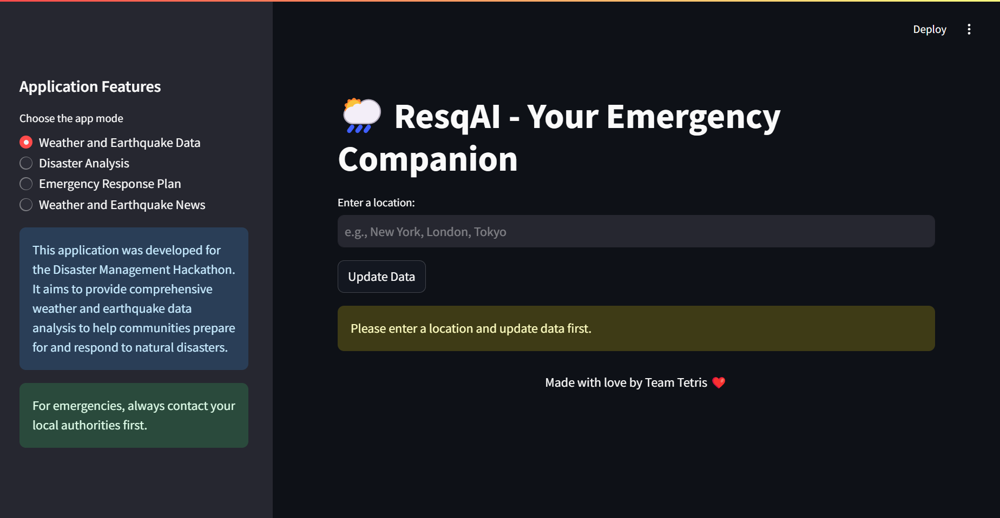

# ResqAI - Your Emergency Companion

<div align="center">

</div>

## Overview

ResqAI is a tool that provides weather forecasts, earthquake data, disaster analysis, emergency response plans, and the latest weather and earthquake news. It uses advanced AI models and LLMs to help you stay prepared for emergencies.

## Features

- **Weather and Earthquake Data**: Get the latest information for any location.
- **Disaster Analysis**: Understand potential risks.
- **Emergency Response Plan**: AI-generated plans to help you respond to disasters.
- **News**: Stay updated with the latest weather and earthquake news.

## How to Install

### Prerequisites

- Python 3.8+
- Streamlit
- Requests
- Python-dotenv
- Boto3
- ReportLab
- PyPDF2
- Pandas
- Plotly
- Geopy
- Folium
- streamlit-folium
- Google API Client

### Setup

1. **Clone the Repository**

```bash
git clone https://github.com/rsharvesh16/ResqAI.git
cd resqai
```

2. **Install Dependencies**

```bash
pip install -r requirements.txt
```

3. **Set Up Environment Variables**

Create a `.env` file in the project root and add:

```env
LANGCHAIN_API_KEY=<Your LangChain API Key>
LANGCHAIN_PROJECT = "Rescue-AI-Disaster Management"
API_KEY=<Your Weather API Key>
GOOGLE_API_KEY=<Your Google API Key>
GOOGLE_CSE_ID=<Your Google Custom Search Engine ID>
```

4. **Run the Application**

```bash
streamlit run app.py
```

## How to Use

1. **Enter Location**: Type in the location you want to check.
2. **Update Data**: Click "Update Data" to get the latest information.
3. **Navigate**: Use the sidebar to explore different features:
   - Weather and Earthquake Data
   - Disaster Analysis
   - Emergency Response Plan
   - News

## Project Structure

```
resqai/
│
├── data/                           # PDF reports
├── faiss_index/                    # AI index data
├── .env                            # Environment variables
├── app.py                          # Main application file
├── requirements.txt                # Dependencies
└── README.md                       # This file
```

## Contributing

We welcome contributions! Check the [CONTRIBUTING.md](CONTRIBUTING.md) file for details.

## License

This project is under the MIT License. See the [LICENSE](LICENSE) file for details.

## Acknowledgements

- Data from [WeatherAPI](https://www.weatherapi.com/) and [USGS](https://earthquake.usgs.gov/)
- Powered by [LangChain](https://langchain.com/)
- Maps by [Folium](https://python-visualization.github.io/folium/)
- Visuals by [Plotly](https://plotly.com/)

---

Feel free to customize this README further to fit your specific needs and add any additional information as necessary.
